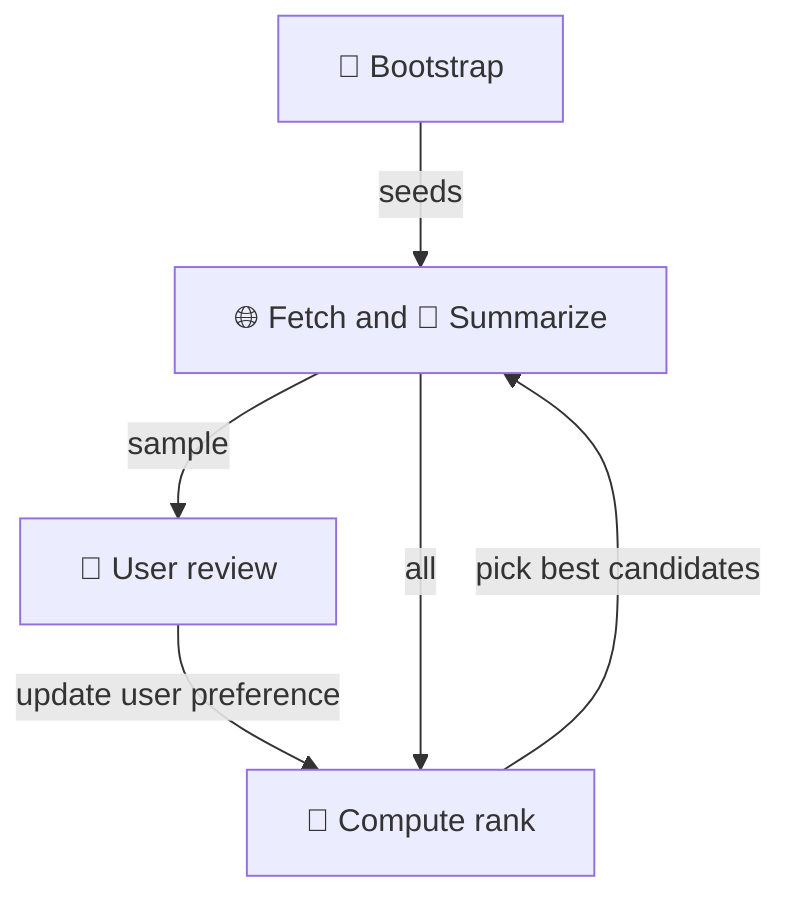
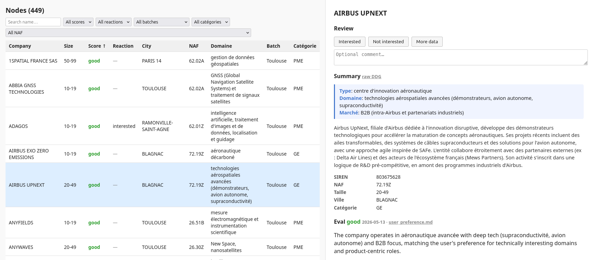

# ANPE-2k26

Personal job-search assistant for discovering companies you don't know exist yet.

Built with Mistral AI, SIRENE dataset and Claude.

## How it works



Web app view:


## Quickstart

Requires [uv](https://docs.astral.sh/uv/).

```bash
git clone <repo-url>
cd anpe2k26
uv sync
cp .env.example .env   # then add your MISTRAL_API_KEY
```

## Usage

**1. Configure your search** — edit `user_vault/seed_query.yaml` to set NAF codes, locations, and company size range.

**2. Bootstrap** — fetch matching companies from the SIRENE dataset:

```bash
uv run anpe bootstrap
```

**3. Run the enrichment loop** — fetch web pages, summarize, and rank candidates:

```bash
source loop.sh
```

**4. Review results** — open the web app to browse and react to companies:

```bash
uv run anpe web
```

**5. Refine preferences** — edit `user_vault/user_preference.md` to update what you're looking for, then re-run `loop.sh` to re-rank.

User data (companies, profile, logs) lives in `user_vault/` — gitignored.

## Dev

```bash
uv run pytest      # run tests
uv run ruff check  # lint
uv run mypy anpe/  # type check
```


- [Vision and goals](docs/specs/10_vision.md)
- [Full spec index](docs/specs/README.md)
