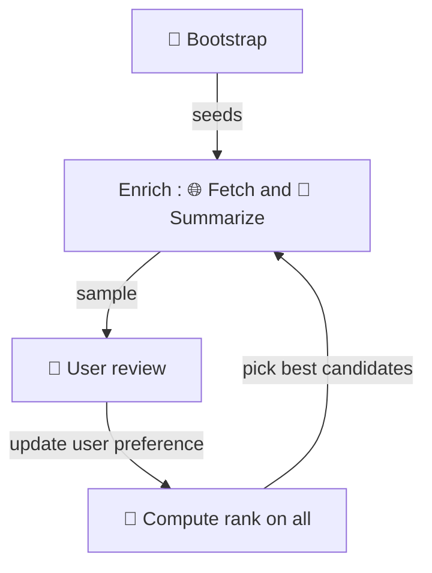
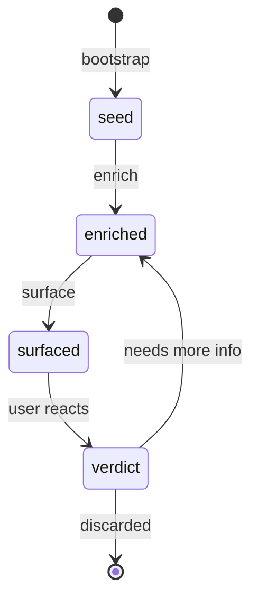

# The Exploration Loop

The core mechanism is a loop: pull candidates from the registry, enrich them, surface
the most promising ones, react, and repeat. There is no fixed session boundary — the
loop can be interrupted and resumed at any point without loss of state. A session is
simply the time the user is available.

## Loop flow

Bootstrap is a one-time (or occasional) step — it seeds the candidate pool from SIRENE.
The inner loop is: enrich a sample of candidates, present them to the user for review,
re-rank the full pool based on updated preferences, then pick the best candidates to
enrich next. The loop repeats indefinitely.

## Candidate states

A candidate moves forward as the system learns more about it. Verdicts are not final —
a candidate can be re-enriched if new information might change the picture.

## What drives the loop

The loop is not exhaustive. At each turn, only a small number of candidates are enriched
and surfaced. What gets picked next is guided by the user profile — a living record of
what the user has reacted to so far. The profile sharpens over time, making each turn
of the loop more focused than the last.

The next document covers the methods that make enrichment possible, and the design
constraints they impose.
