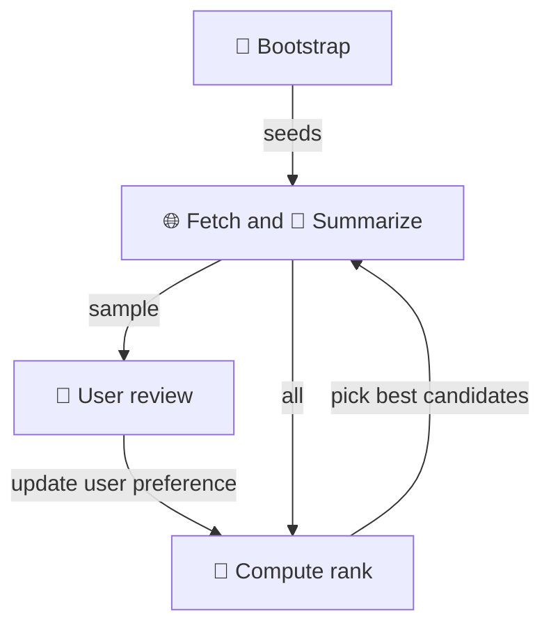

# The Exploration Loop

The core mechanism is a loop: pull candidates from the registry, enrich them, surface
the most promising ones, react, and repeat. There is no fixed session boundary — the
loop can be interrupted and resumed at any point without loss of state. A session is
simply the time the user is available.

## Loop flow

Bootstrap is a one-time (or occasional) step — it seeds the candidate pool from SIRENE.
The inner loop is: enrich a sample of candidates, present them to the user for review,
re-rank the full pool based on updated preferences, then pick the best candidates to
enrich next. The loop repeats indefinitely.

## Candidate states

Each candidate carries two independent verdicts:

- **User verdict** — set when the user has reviewed the candidate: `interesting`, `not interesting`, or `keep` (not enough data yet), with an optional free-text reason.
- **LLM verdict** — predicted from enriched data and the current user profile: same three labels.

The `seen_by_user` flag tracks whether the candidate has been surfaced to the user yet.

User verdicts feed back into the user profile, which the user can also edit directly.

The LLM verdict drives what happens next:

| LLM verdict       | seen by user | → next action     |
| ----------------- | ------------ | ----------------- |
| `interesting`     | no           | → surface to user |
| `interesting`     | yes          | → nothing (done)  |
| `keep`            | any          | → enrich further  |
| `not interesting` | any          | → discard         |

For seen candidates, the user verdict takes precedence over the LLM verdict. `keep` is a transient state — after each enrichment pass the LLM re-evaluates, eventually resolving to `interesting` or `not interesting`. A maximum retry count prevents indefinite cycling.

The goal is not a full ranking. The candidate space is sparse — most companies are irrelevant, a few are strong matches. The system needs to surface those few, not order all 200.

## What drives the loop

The loop is not exhaustive. At each turn, only a small number of candidates are enriched
and surfaced. What gets picked next is guided by the user profile — a living record of
what the user has reacted to so far. The profile sharpens over time, making each turn
of the loop more focused than the last.

The next document covers the methods that make enrichment possible, and the design
constraints they impose.
