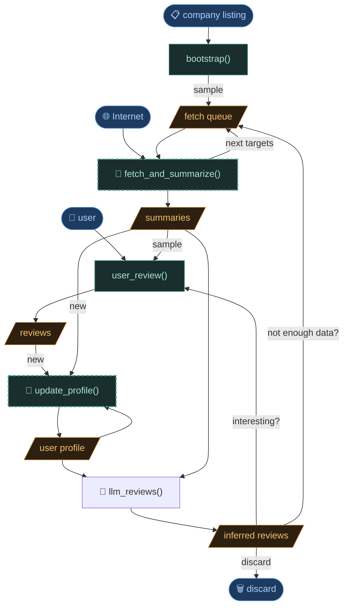

# Pipeline overview

The enrichment pipeline...

Each step is independent and retryable. State
is stored on disk — the pipeline can be interrupted and resumed at any point.Each output should reference the input used (path to file).

## Pipeline Workflow Graph



legend:

- // data
- () external inputs
- [] steps

---

## Steps

### `bootstrap()`

Queries the SIRENE registry API to build a list of candidate companies matching the search criteria.

|            |                                                               |
| ---------- | ------------------------------------------------------------- |
| **Input**  | user pre-selection (search criteria: NAF codes, region, size) |
| **Output** | `company_listing.csv` — list of candidates (~2k entries)      |
| **Reads**  | SIRENE API                                                    |

Only a sample of the listing is seeded into the pipeline —
not every company gets enriched. (This is for now arbitrary, alphabetical order...)
Command `anpe proscect seed` is used to create node

---

### `fetch_and_summarize()` 🤖

Core enrichment loop. Pops one target from the fetch queue, fetches raw data
from the internet, and calls the LLM to produce or update the company summary.
Proposes next targets (e.g. website URL after a web search), which are enqueued
for the next iteration.

Internally uses three **fetch tools** in sequence:

- **`siren`** — registry data (name, NAF, headcount, city) → stored in frontmatter
- **`ddg`** — DuckDuckGo search snippets for the company name
- **`fetch_url`** _(not yet implemented)_ — main content from company website via `trafilatura`

The LLM receives: raw fetch output + company profile (from frontmatter). It does
**not** receive the user profile — summaries are objective descriptions, not
filtered by current preferences.

|                         |                                                                          |
| ----------------------- | ------------------------------------------------------------------------ |
| **Input**               | fetch queue, Internet                                                    |
| **Output**              | summaries, next targets → fetch queue                                    |
| **LLM output status**   | `ok` · `no_data` · `not_relevant`                                        |
| **Files written**       | `raw_data/raw_<tool>_<...>`, `summarize/sum_<...>_<ts>.json` (immutable) |
| **`fetch.jsonl` event** | `summarize_done {uid, model, prompt_version, status, result_file}`       |

`no_data` — raw input had no information beyond frontmatter. Node is done, no new targets enqueued.

`not_relevant` — company does not match the search domain. Dead end, discarded.

---

### `review()` _(manual step)_

User pages through a sample of summaries in the terminal and records a one-line
free-text reaction per company. Not every summary is reviewed — only a sample.

|                   |                                                                       |
| ----------------- | --------------------------------------------------------------------- |
| **Input**         | summaries (sample), user                                              |
| **Output**        | reactions                                                             |
| **Files written** | `reviews.jsonl` — append-only, `{ts, reaction}` or `{ts, skip: true}` |

A node is considered reviewed when its latest `reviews.jsonl` event has a non-empty `reaction`.

---

### `update_profile()` 🤖 _(not yet implemented)_

Synthesizes new reactions (since last update) and the current profile into an
updated profile. Only reactions and summaries newer than `profile.updated_ts`
are included — already-incorporated signal is skipped.

|                   |                                                                       |
| ----------------- | --------------------------------------------------------------------- |
| **Input**         | reactions (new), summaries (new), user profile (current)              |
| **Output**        | user profile (updated)                                                |
| **Files written** | `user_data/profile.md` (overwritten), `updated_ts` set in frontmatter |

---

### `score()` 🤖 _(not yet implemented)_

Classifies each summary against the current user profile. Runs on all nodes
with a stale or missing score after a profile update.

|                            |                                                           |
| -------------------------- | --------------------------------------------------------- |
| **Input**                  | summaries, user profile                                   |
| **Output**                 | inferred scores                                           |
| **Score values**           | `good` · `maybe` · `discard` · `enrich` + one-line reason |
| **Frontmatter fields set** | `score`, `score_reason`, `score_ts`, `score_profile_ts`   |

`enrich` — not enough information to decide; re-queues fetch targets.

`discard` — clear non-match; node is removed from the active list.

`score_profile_ts` enables staleness detection: if `profile.md` `updated_ts` is newer than `score_profile_ts`, the score needs recomputing.

---

## Node directory layout

```
nodes/<node_id>/
  fetch.jsonl          # append-only state machine log
  summary.md           # frontmatter (registry data) + current summary body
  reviews.jsonl        # append-only review log
  raw_data/
    raw_siren_<...>.json
    raw_ddg_<...>.txt
    raw_fetch_url_<...>.txt
  summarize/
    sum_<tool>_<target>_<status>_<ts>.json   # one per llm_summarize run, immutable
    prompt_<...>.txt                          # prompt debug file (optional)
```

### `fetch.jsonl` event types

| Event                                 | Key fields                                                |
| ------------------------------------- | --------------------------------------------------------- |
| `put`                                 | `uid`, `tool`, `target`                                   |
| `fetch_done`                          | `uid`, `raw_file`                                         |
| `fetch_error`                         | `uid`, `detail`                                           |
| `not_found` · `blocked` · `retryable` | `uid`, `detail`                                           |
| `summarize_done`                      | `uid`, `model`, `prompt_version`, `status`, `result_file` |
| `summarize_error`                     | `uid`, `detail`                                           |

### `summary.md` structure

```markdown
---
siren: "885167940"
name: INFINITE ORBITS
naf: 62.01Z — Programmation informatique
category: PME
headcount: 20-49
city: TOULOUSE
score: good # set by score step (not yet implemented)
score_reason: "produit propre, NewSpace, petite équipe"
score_ts: 2026-05-04T10:00:00Z
score_profile_ts: 2026-05-04T10:00:00Z
---

Type: éditeur · Domaine: spatial, IA · Marché: B2B

[summary body...]
```

---

## Open design question — summary versioning

`summary.md` body is currently overwritten on each `llm_summarize` run.
The immutable result file (`summarize/sum_*.json`) preserves old summaries, but
`reviews.jsonl` events do not reference which summary version they were written
against.

At scale (100+ reviews), this creates a traceability gap: a reaction was made
against a specific summary, but after re-summarization that link is lost.

Planned fix: each `reviews.jsonl` event will carry a `sum_id` field referencing
the `result_file` the user actually read. `summary.md` becomes a materialized
view of the latest `sum_id`, not the source of truth.
