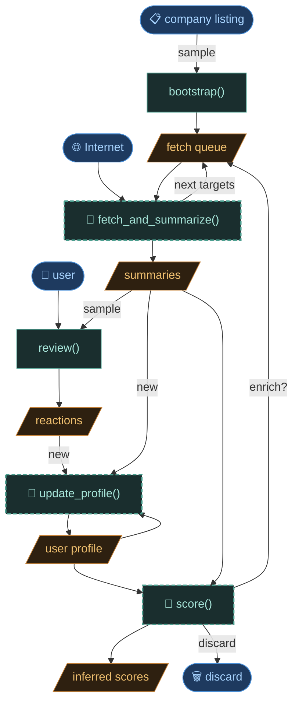

# Pipeline overview

The enrichment pipeline takes a company SIREN number and progressively builds a
summary from public data sources. Each step is independent and retryable. State
is stored on disk — the pipeline can be interrupted and resumed at any point.

## Graph



---

## Steps

### `seed`

Entry point. Creates a node directory and enqueues the first target.

|                   |                                                                                                         |
| ----------------- | ------------------------------------------------------------------------------------------------------- |
| **Input**         | SIREN number, company name (from `company_listing.csv`)                                                 |
| **Output**        | Node directory created, `fetch.jsonl` initialized with one `put` event `{tool: siren, target: <SIREN>}` |
| **Files written** | `nodes/<node_id>/fetch.jsonl`                                                                           |

---

### `siren`

Fetches company registry data from the SIRENE API.

|                            |                                                                       |
| -------------------------- | --------------------------------------------------------------------- |
| **Input**                  | SIREN number                                                          |
| **Output**                 | Raw JSON from SIRENE API                                              |
| **Files written**          | `raw_data/raw_siren_<...>.json`                                       |
| **Frontmatter fields set** | `siren`, `name`, `name_legal`, `naf`, `category`, `headcount`, `city` |
| **Next target enqueued**   | `{tool: ddg, target: "<name> entreprise informatique"}`               |

---

### `ddg`

Fetches search snippets from DuckDuckGo for a query string.

|                   |                                                                 |
| ----------------- | --------------------------------------------------------------- |
| **Input**         | Query string (e.g. `"Infinite Orbits entreprise informatique"`) |
| **Output**        | Raw text snippets from DDG                                      |
| **Files written** | `raw_data/raw_ddg_<...>.txt`                                    |
| **On error**      | `not_found`, `blocked`, `retryable` → terminal or manual retry  |

---

### `fetch_url` _(not yet implemented)_

Fetches and extracts main content from a web page via `trafilatura`.

|                   |                                                                          |
| ----------------- | ------------------------------------------------------------------------ |
| **Input**         | URL (from `new_targets` proposed by `llm_summarize`)                     |
| **Output**        | Clean prose extracted from the page                                      |
| **Files written** | `raw_data/raw_fetch_url_<...>.txt`                                       |
| **On error**      | `not_found` (JS-heavy SPA, empty body), `blocked` (Cloudflare, LinkedIn) |

---

### `llm_summarize`

Core LLM step. Reads raw fetch output and the current summary, returns an
updated summary and proposed next targets.

|                          |                                                                                       |
| ------------------------ | ------------------------------------------------------------------------------------- |
| **Input**                | Raw fetch output, current `summary.md` body, company profile block (from frontmatter) |
| **Model**                | Configurable via `OPENROUTER_MODEL` / `MISTRAL_MODEL`                                 |
| **Output status**        | `ok` · `no_data` · `not_relevant`                                                     |
| **Files written**        | `summarize/sum_<tool>_<target>_<status>_<ts>.json` (one per run, immutable)           |
| **`summary.md` updated** | Body overwritten (frontmatter preserved) — _to be versioned, see below_               |
| **`fetch.jsonl` event**  | `summarize_done {uid, model, prompt_version, status, result_file}`                    |
| **`new_targets`**        | List of `{tool, target}` pairs enqueued as new `put` events                           |

`no_data` means the raw input contained no information beyond what is already in
frontmatter. The node is considered done — no new targets are enqueued.

`not_relevant` means the company does not match the search domain. Dead end — no
new targets enqueued, node is discarded.

---

### `review` _(manual step)_

User reads `summary.md` body in the terminal and records a free-text reaction.

|                   |                                                              |
| ----------------- | ------------------------------------------------------------ |
| **Input**         | `summary.md` body, frontmatter (`name`, `city`, `headcount`) |
| **Output**        | One-line reaction string                                     |
| **Files written** | `reviews.jsonl` — append-only, one event per interaction     |
| **Event fields**  | `{ts, reaction}` or `{ts, skip: true}`                       |

A node is considered reviewed when its latest `reviews.jsonl` event has a
non-empty `reaction`.

---

### `profile update` _(not yet implemented)_

LLM step. Synthesizes all unincorporated reactions into an updated `profile.md`.

|                           |                                                                             |
| ------------------------- | --------------------------------------------------------------------------- |
| **Input**                 | `profile.md`, all `reviews.jsonl` reactions newer than `profile.updated_ts` |
| **Output**                | Full updated profile text                                                   |
| **Files written**         | `user_data/profile.md` (overwritten)                                        |
| **Frontmatter field set** | `updated_ts` — used to track which reactions are already incorporated       |

---

### `score` _(not yet implemented)_

LLM classification step. Scores a node against the current profile.

|                            |                                                           |
| -------------------------- | --------------------------------------------------------- |
| **Input**                  | `summary.md` body, `profile.md`                           |
| **Output**                 | `good` · `maybe` · `discard` · `enrich` + one-line reason |
| **Frontmatter fields set** | `score`, `score_reason`, `score_ts`, `score_profile_ts`   |

`enrich` re-queues fetch steps when there is not enough information to decide.
`score_profile_ts` enables staleness detection: if `profile.md` `updated_ts` is
newer, the score needs recomputing.

---

## Node directory layout

```
nodes/<node_id>/
  fetch.jsonl          # append-only state machine log
  summary.md           # frontmatter (registry data) + current summary body
  reviews.jsonl        # append-only review log
  raw_data/
    raw_siren_<...>.json
    raw_ddg_<...>.txt
    raw_fetch_url_<...>.txt
  summarize/
    sum_<tool>_<target>_<status>_<ts>.json   # one per llm_summarize run, immutable
    prompt_<...>.txt                          # prompt debug file (optional)
```

### `fetch.jsonl` event types

| Event                                 | Key fields                                                |
| ------------------------------------- | --------------------------------------------------------- |
| `put`                                 | `uid`, `tool`, `target`                                   |
| `fetch_done`                          | `uid`, `raw_file`                                         |
| `fetch_error`                         | `uid`, `detail`                                           |
| `not_found` · `blocked` · `retryable` | `uid`, `detail`                                           |
| `summarize_done`                      | `uid`, `model`, `prompt_version`, `status`, `result_file` |
| `summarize_error`                     | `uid`, `detail`                                           |

### `summary.md` structure

```markdown
---
siren: "885167940"
name: INFINITE ORBITS
naf: 62.01Z — Programmation informatique
category: PME
headcount: 20-49
city: TOULOUSE
score: good # set by score step (not yet implemented)
score_reason: "produit propre, NewSpace, petite équipe"
score_ts: 2026-05-04T10:00:00Z
score_profile_ts: 2026-05-04T10:00:00Z
---

Type: éditeur · Domaine: spatial, IA · Marché: B2B

[summary body...]
```

---

## Open design question — summary versioning

`summary.md` body is currently overwritten on each `llm_summarize` run.
The immutable result file (`summarize/sum_*.json`) preserves old summaries, but
`reviews.jsonl` events do not reference which summary version they were written
against.

At scale (100+ reviews), this creates a traceability gap: a reaction was made
against a specific summary, but after re-summarization that link is lost.

Planned fix: each `reviews.jsonl` event will carry a `sum_id` field referencing
the `result_file` the user actually read. `summary.md` becomes a materialized
view of the latest `sum_id`, not the source of truth.
